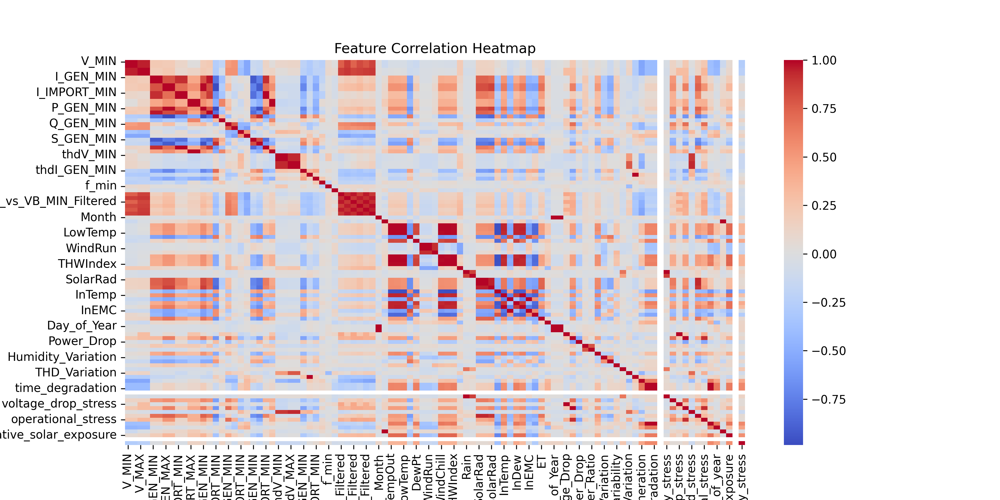
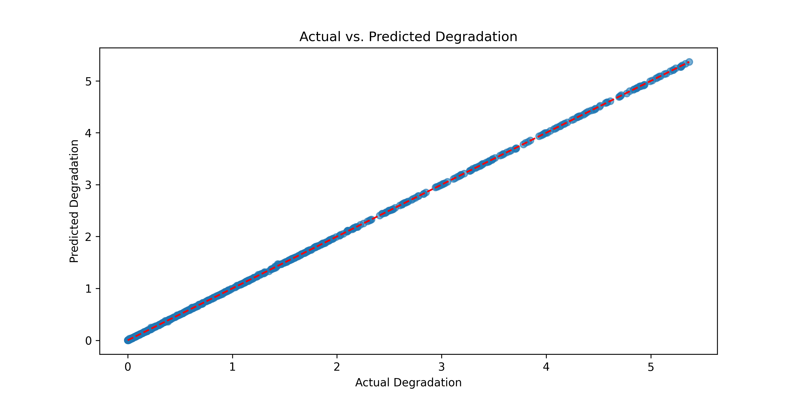
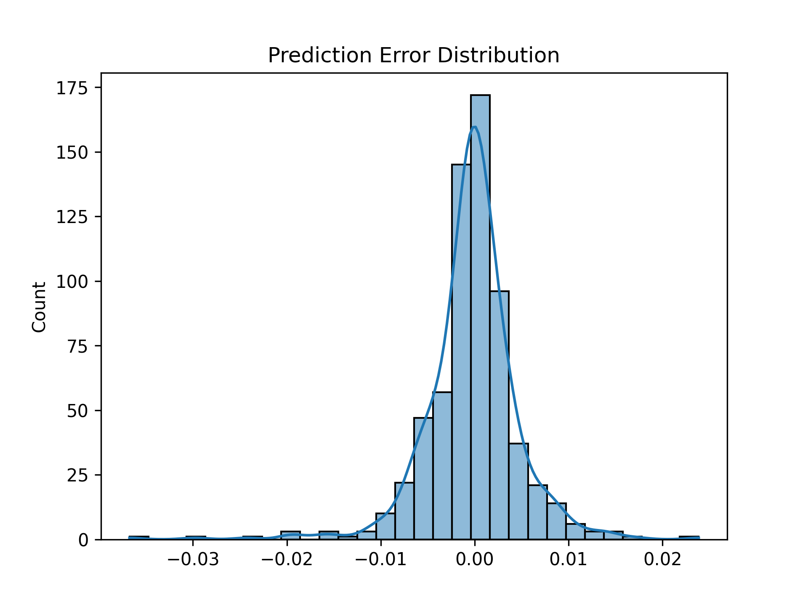
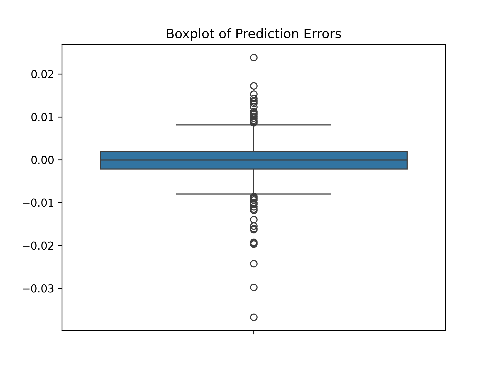

# **Solar Panel Degradation Prediction** 🔆🔋  
This repository contains a **Machine Learning** model that predicts **solar panel degradation** using various environmental and electrical parameters. The project is divided into **two parts**:  

1️⃣ **Model Training**: Trains the ML model, saves it as `solar_model.pkl`, and generates various plots.  
2️⃣ **Model Inference**: Loads the trained model, takes user input, and predicts degradation.  

## 📌 **Project Features**  
✅ **Trains a Regression Model** to predict solar panel degradation.  
✅ **Uses a `.pkl` file** to save and load the model.  
✅ **Generates 10+ Plots** for data analysis & performance evaluation.  
✅ **User Input**: Allows users to test the model with real-world values.  

---

## 📂 **Directory Structure**  
```
├── plots/                                    # Folder containing generated plots
│   ├── heatmap.png
│   ├── actual_vs_predicted.png
│   ├── error_distribution.png
│   ├── boxplot.png
├── Solar Panel Degradation Predictor.ipynb   # Training script (generates pkl file) & Loads the trained model & makes predictions
├── requirements.txt                          # List of dependencies
├── README.md                                 # Project documentation
```

---

## 🛠 **Installation & Setup**  

1️⃣ **Clone the Repository**  
```bash
git clone https://github.com/your-username/solar-degradation-prediction.git
cd solar-degradation-prediction
```

2️⃣ **Install Dependencies**  
```bash
pip install -r requirements.txt
```

3️⃣ **Train the Model & Generate Plots**  
```bash
jupyter notebook
Solar Panel Degradation Predictor.ipynb
```

4️⃣ **Make Predictions using the Model**  
---

## 📊 **Generated Plots**  
The model generates several **visualizations** for better understanding.  

### 🔥 **1. Heatmap (Feature Correlation)**  
Shows correlations between input features.  
  

### 📈 **2. Actual vs. Predicted Values**  
Compares predicted degradation values with actual ones.  
  

### 📊 **3. Error Distribution**  
Displays prediction errors using a histogram.  
  

### 📦 **4. Boxplot of Prediction Errors**  
Shows the distribution of prediction errors.  
  

---

## 🚀 **Future Improvements**  
- Add **real-time weather data integration** for better predictions.  
- Experiment with **Deep Learning models (LSTMs, CNNs, Transformers)**.  
- Develop a **Web App (Streamlit or Flask)** for an interactive UI.  

---

## 🤝 **Contributing**  
Contributions are welcome! Feel free to submit a **pull request** or open an **issue**.  
